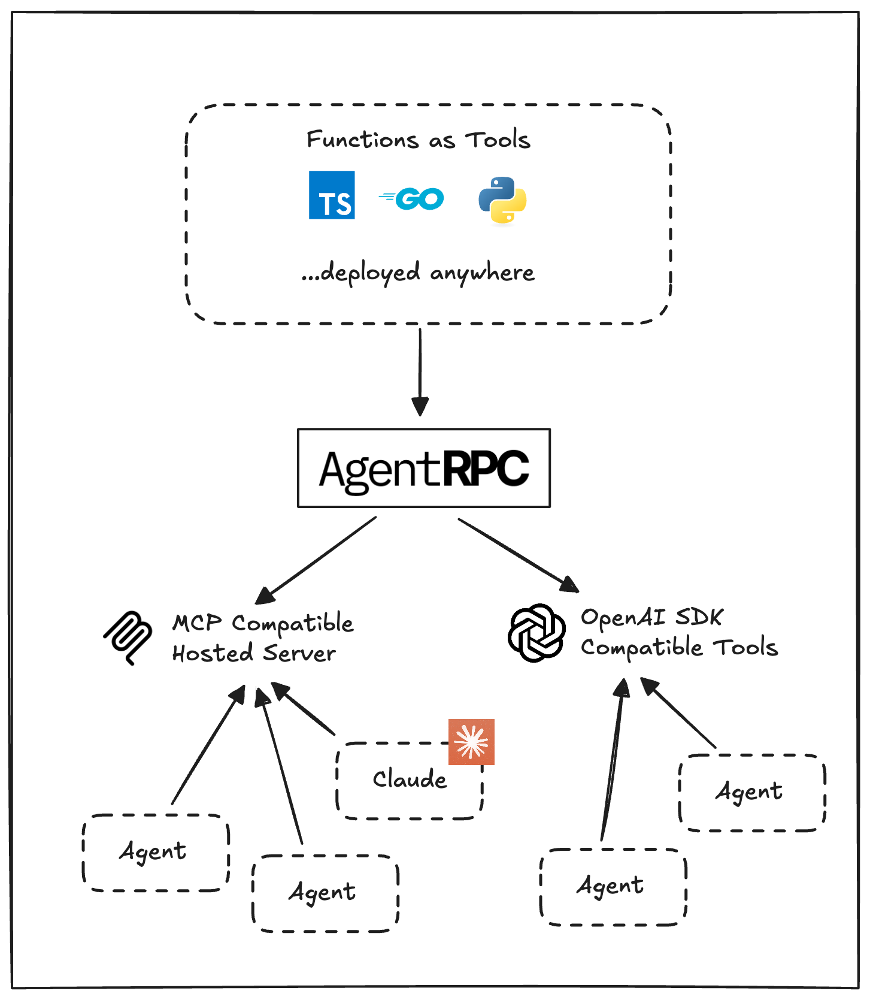

# AgentRPC

   

> Universal RPC layer for AI agents across network boundaries and languages

## Overview

AgentRPC allows you to connect to any function, in any language, across network boundaries. It\'s ideal when you have services deployed in:
- Private VPCs
- Kubernetes clusters
- Multiple cloud environments

AgentRPC wraps your functions in a universal RPC interface, connecting them to a hosted RPC server accessible through open standards:

- Model Context Protocol (MCP)
- OpenAI-compatible tool definitions (OpenAI, Anthropic, LiteLLM, OpenRouter, etc.)

<p align="center">

</p>

## Monorepo Structure

This repository is structured as a monorepo, containing several related packages and SDKs under the `packages/` directory. Each package is independently versioned and published, but managed within this single repository.

The main packages include:
*   `gemini-cli`: The command-line interface for interacting with AgentRPC.
*   `json-rpc-2.0`: A library for JSON-RPC 2.0 client and server communication.
*   `sdk-go`: The Go SDK for AgentRPC.
*   `sdk-node`: The Node.js/TypeScript SDK for AgentRPC.
*   `sdk-python`: The Python SDK for AgentRPC.

## How It Works

1.  **Registration**: Use our SDK to register functions and APIs in any language
2.  **Management**: The AgentRPC platform (api.agentrpc.com) registers the function and monitors its health
3.  **Access**: Receive OpenAPI SDK compatible tool definitions and a hosted MCP server for connecting to compatible agents

## Key Features

| Feature | Description |
|---------|-------------|
| **Multi-language Support** | Connect to tools in TypeScript, Go, Python and .NET (coming soon) |
| **Private Network Support** | Register functions in private VPCs with no open ports required |
| **Long-running Functions** | Long polling SDKs allow function calls beyond HTTP timeout limits |
| **Full Observability** | Comprehensive tracing, metrics, and events for complete visibility |
| **Automatic Failover** | Intelligent health tracking with automatic failover and retries |
| **Framework Compatibility** | Out-of-the-box support for MCP and OpenAI SDK compatible agents |

## Getting Started

### Quick Start

Follow the [quick start](https://docs.agentrpc.com/quickstart) example on our docs site.

### Examples

Explore working examples in the [examples](./examples) directory.

### Working with Individual Packages

To work with a specific package, navigate to its directory under `packages/`. Each package has its own `README.md` with specific instructions.

## MCP Server

The AgentRPC TypeScript SDK includes an optional MCP (Model Context Protocol) server.

```sh
ANGENTRPC_API_SECRET=YOUR_API_SECRET npx agentrpc mcp
```

This launches an MCP-compliant server for external AI models to interact with your registered tools.

### Claude Desktop Integration

Add to your `claude_desktop_config.json`:

```json
{
  "mcpServers": {
    "agentrpc": {
      "command": "npx",
      "args": [
        "-y",
        "agentrpc",
        "mcp"
      ],
      "env": {
        "AGENTRPC_API_SECRET": "<YOUR_API_SECRET>"
      }
    }
  }
}
```

[More Info](https://modelcontextprotocol.io/quickstart/user)

### Cursor Integration

Add to your `~/.cursor/mcp.json`:

```json
{
  "mcpServers": {
    "agentrpc": {
      "command": "npx",
      "args": ["-y", "agentrpc", "mcp"],
      "env": {
        "AGENTRPC_API_SECRET": "<YOUR_API_SECRET>"
      }
    }
  }
}
```

[More Info](https://docs.cursor.com/context/model-context-protocol#configuring-mcp-servers)

## License

This project is licensed under the Apache License 2.0 - see the LICENSE file for details.

This repository contains the open-source components and SDKs for AgentRPC, organized as a monorepo.